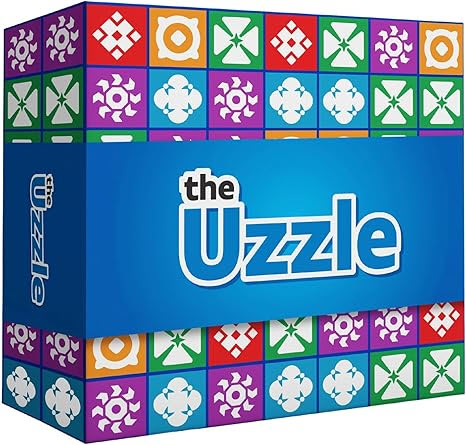
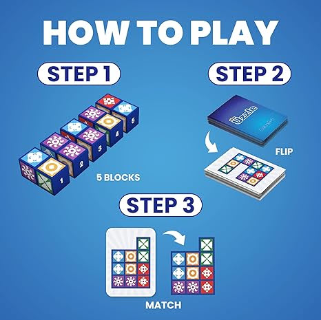

# The Uzzle

[The Uzzle Game](https://www.amazon.com/Uzzle-Popular-Suitable-Children-Pattern/dp/B0BFP4VZCP)

 

# Glyphs

There are five pictures (glyphs) in the game. I will model individual glyphs as lowercase letters that
match the glyphs' background (red, purple, green, blue, and orange). These pictures are symmetrical --
the same in any rotation.


# Like Dominoes

Each player starts the game with the same five game pieces. A single piece is a long box with the piece's number
printed on both ends. Each piece is a set of four sides. Each side is two glyphs.

The player must organize the five pieces so that the top sides form the pattern shown on the selected card. The pieces
are turned to choose a side. The pieces are rotated and moved to build the picture. The first player to build the
selected pattern wins the round.

The two-glyph sides are like dominoes with pictures instead of dots. Five pictures would be 0-4 -- a double-4 domino
set. There are 15 unique dominoes as shown below.


# Pieces

Each piece is a box of 8 cells. The end caps of each piece shows the piece's number. Each cell is one of 5 pictures. 
Think of a piece as an 8-digit base-5 number. 5 raised to the 8th power = 390,625 possible pieces.

One side of a piece is a pair of pictures like dominos (discussion above). If we account for rotations (like dominoes), 
then each piece is a 4-digit base-15 number. That's 4 sides where each side is one of the 15 values above. 15 raised 
to the 4th power = 50,625 unique pieces.

But the order of the sides on a piece does not matter. Piece "NLAG" is equivalent to "GALN", which is equivalent to "NAGL".
All of these pieces provide the same set of four sides for the player to use. The easiest way to compare pieces is to sort 
each piece into alphabetical order of sides. All three pieces above become "AGLN" -- the same set of sides.

Accounting for equivalent pieces using [pieces.py#L59](pieces.py#L59) we are left with 3060 unique pieces.

These are the pieces chosen by the Uzzle game team. The picture below was made by starting each piece with the end cap number 
oriented correctly for reading. That is the first picture in each group. The next picture in each group is the piece rotated counterclockwise, and so on for all four sides.


I model each piece as a string of four letters (four sides). From the picture above:

```
1: bo og rr pg -- "NLAG"
2: pp gb or bo -- "FKEN"
3: pb or gg rp -- "HEJB"
4: op gr pg bb -- "ICGM"
5: br oo rp gb -- "DOBK"
```

Why these 5 pieces from the pool of 3060?

I see that all the chosen pieces have 1 or 2 of each possible picture -- no more and no less. 
That makes sense. We want the pieces to be as diverse for a variety of card patterns.

TODO program this
