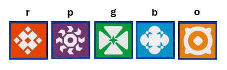
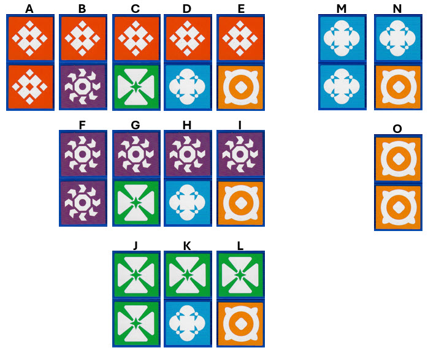

# The Uzzle

[TODO: link](https://www.amazon.com/Uzzle-Popular-Suitable-Children-Pattern/dp/B0BFP4VZCP)


# Glyphs



# Pieces

Each player gets these five pieces:


The end cap of each piece shows the piece number. The above picture was made by starting each piece with the end cap number oriented correctly for reading. That
is the first picture in each group. The next picture in each group is the piece rotated counter clockwise, and so on for all four sides.

There are five distinct pictures. The pictures are modeled by the first letter
of their background color. Thus: P=Purple, B=Blue, O=Orange, G=Green, and R=Red.

The model for a piece in this code is a single string of 8 letters from the picture
above.

```
1: BO OG RR PG -- "BOOGRRPG"
2: PP GB OR BO -- "PPGBORBO"
3: PB OR GG RP -- "PBORGGRP"
4: OP GR PG BB -- "OPGRPGBB"
5: BR OO RP GB -- "BROORPGB"
```

We can think of the faces of the pieces as dominos. Five pictures would be 0 to 4 pips (double 4), which has 15 unique dominos
as shown:


