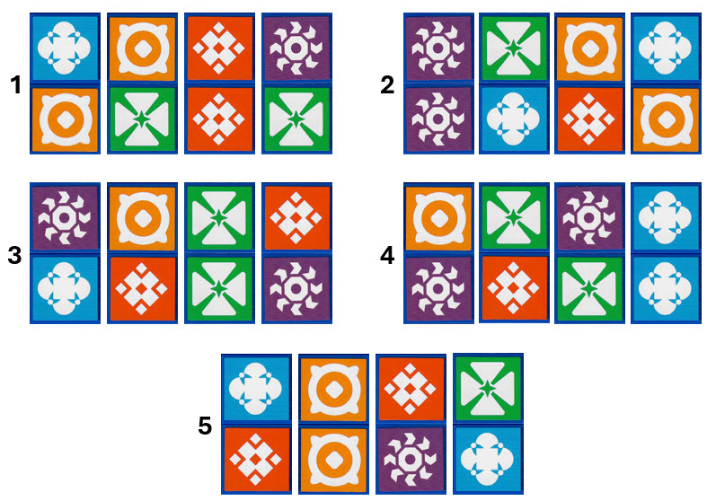

# The Uzzle

[The Uzzle Game](https://www.amazon.com/Uzzle-Popular-Suitable-Children-Pattern/dp/B0BFP4VZCP)

 

# Glyphs

There are five pictures (glyphs) in the game. I will model individual glyphs as lowercase letters that
match the glyphs' backgrounds (red, purple, green, blue, and orange). These pictures are symmetrical --
the same in any rotation.


# Like Dominoes

Each player starts the game with the same five game pieces. A single piece is a long box with the piece's number
printed on both ends. Each piece is a set of four sides. Each side is two glyphs.

The player must organize the five pieces so that the top sides form the pattern shown on the selected card. The pieces
are turned to choose a side. The pieces are rotated and moved to build the picture. The first player to build the
selected pattern wins the round.

The two-glyph sides are like dominoes with pictures instead of dots. Five pictures would be 0-4 -- a double-4 domino
set. There are 15 unique dominoes as shown below.


You see this visually at [Statistics Kingdom](https://www.statskingdom.com/combinations-calculator.html) with n=5, r=2, and 
with-repetitions.

# Pieces

Each piece is a box of 8 cells. The end caps of each piece shows the piece's number. Each cell is one of 5 pictures. 
Think of a piece as an 8-digit base-5 number. 5 raised to the 8th power = 390,625 possible pieces.

You can see this visually at [Statistics Kingdom](https://www.statskingdom.com/permutations-calculator.html) with n=5,
r=8, and with-repetitions.

One side of a piece is a pair of pictures like dominos (discussion above). If we account for rotations (like dominoes), 
then each piece is a 4-digit base-15 number. That's 4 sides where each side is one of the 15 values above. 15 raised 
to the 4th power = 50,625 unique pieces.

You can see this visually at [Statistics Kingdom](https://www.statskingdom.com/permutations-calculator.html) with n=15,
r=4, and with-repetitions.

The order of the sides on a piece does not matter. Piece "NLAG" is equivalent to "GALN", which is equivalent to "NAGL".
All of these pieces provide the same set of four sides for the player to use. The easiest way to compare pieces is to sort 
each piece into alphabetical order of sides. All three pieces above become "AGLN" -- the same set of sides.

Accounting for equivalent pieces using [report_all_unique_pieces](pieces.py#L78) we are left with 3,060 unique pieces.

You can see this visually at [Statistics Kingdom](https://www.statskingdom.com/combinations-calculator.html) with n=15,
r=4, and with-repetitions.

# Piece Diversity

Below are the pieces chosen by the Uzzle game team. The picture below was made by starting each piece with the end cap number 
oriented correctly for reading. That makes the first picture in each group. The next picture in each group is the piece rotated 
counterclockwise, and so on for all four sides.



I model each piece as a string of four letters (four sides). From the picture above:

```
1: bo og rr pg -- "NLAG"
2: pp gb or bo -- "FKEN"
3: pb or gg rp -- "HEJB"
4: op gr pg bb -- "ICGM"
5: br oo rp gb -- "DOBK"

The set as a sorted string: "AGLN BDKO BEHJ CGIM EFKN"
```

Why these 5 pieces from the pool of 3060?

I see that all the chosen pieces have 1 or 2 of each possible picture -- no more and no less. 
That makes sense; the pieces should be diverse for a variety of card patterns.

I see that all the chosen pieces have exactly 1 "double".

Accounting for these diversity rules with [report_all_allowed_pieces](pieces.py#L88) leaves us with 90 pieces.

# Set of Pieces Diversity

With a pool of 90 pieces, how many sets of 5 can we make? 

Using the [Combination Calculator](https://www.statskingdom.com/combinations-calculator.html)
we have n=90 and r=5. There are 43,949,268 sets of 5 pieces.

Let's look at the diversity over an entire set of pieces. We'd like to use every side in a set of pieces.
There are 15 possible sides in the pool. There are 20 sides total in a set of pieces. We give each piece
three of the sides. That leaves one side on each piece that must a duplicate.

That gives us 15 sides that are used just once, and 5 sides that are used twice.

Applying this rule with [report_all_allowed_sets](pieces.py#L140) gives us 62,892 possible sets of 5 pieces.

I counted the number of each glyph in the given set of pieces:

```
r: 8
p: 8
g: 8
b: 8
o: 8
```

We will say that any set of 5 pieces must have exactly 8 of each glyph. Applying this rule with 
[report_all_allowed_sets_eight_glyphs](pieces.py#L146) gives us 6,072 possible sets of 5 pieces.

It takes 4 minutes to produce the list of 6,072 possible sets. I wrote the possibles to [allowed_sets.json](allowed_sets.json)
for speedy loading in the next sections. The given set of pieces is on line [2488](allowed_sets.json#L2488) of 
the file.

Hopefully, I'll discover other rules to cull the possible sets. If you think of any, let me know!

# Cards

TODO
